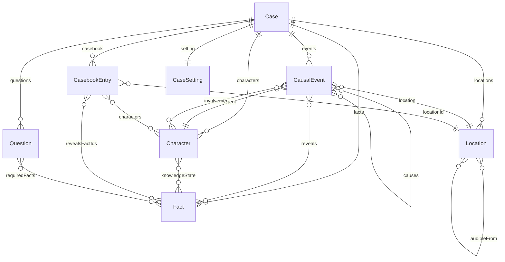
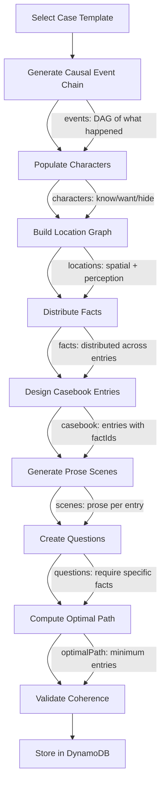

# Consulting Detective -- Data Model Design

## Data Structure Relationships

The Case is the top-level container. Everything else hangs off it.



### Key Relationships

- **Events -> Characters**: Every event has an agent (who did it) and an involvement map tracking how other characters are connected: participant, witness_visual, witness_auditory, informed_after, or discovered_evidence.
- **Events -> Locations**: Every event happened somewhere. Location perception edges (visibleFrom, audibleFrom) constrain who could have witnessed it.
- **Events -> Facts**: Events reveal facts to witnesses. This is the bridge between "what happened" and "what's discoverable."
- **Characters -> Facts**: The knowledge state tracks what each character knows, suspects, or believes falsely about each fact. This shapes what they'll say in their casebook scene.
- **CasebookEntries -> Locations + Characters + Facts**: Entries are the player-facing game mechanic. Each entry takes place at a location, involves certain characters, and reveals specific facts.
- **Questions -> Facts**: Each question requires specific facts to answer. This is what makes the game work: the player must visit enough entries to discover the facts needed.
- **Case.optimalPath -> CasebookEntries**: The minimum set of entries that covers all facts required by all questions. This is Holmes's solution path.

### What the Player Sees vs. What the Generator Builds

The player only interacts with:
- The **introduction** (read once)
- The **casebook** (pick entries to visit, read scenes)
- The **questions** (answer at the end)

Everything else (events, locations, character knowledge states) is generation scaffolding that ensures the case is internally consistent. The player never sees the causal chain or the location graph directly -- they experience them through the prose scenes.

---

## Generation Pipeline



### Pipeline Steps

1. **Select Case Template**: Choose a parameterized crime type (theft-for-debt, jealousy murder, accidental death covered up, etc.) with required event slots and character roles.

2. **Generate Causal Event Chain**: Fill the template's event DAG with specific details. Each event gets an agent, location, timestamp, and necessity. Required events form the spine; contingent events add texture. The DAG's `causes` edges define what-leads-to-what.

3. **Populate Characters**: Assign characters to event agent slots. For each character, determine: what they know (knowledgeState), what they want, what they hide, and how they speak (tone). Characters not directly involved in events can serve as witnesses, red herrings, or color.

4. **Build Location Graph**: Create the spatial world. Assign events to locations. Define containment (room in building), adjacency, and perception edges (visibleFrom, audibleFrom). These constrain who could have witnessed what.

5. **Distribute Facts**: Extract facts from events and character states. Tag each fact with a category (motive, means, opportunity, etc.) and mark whether it's critical. Decide which facts each character knows about.

6. **Design Casebook Entries**: Create the player-facing address book. Each entry maps to a location, lists present characters, and specifies which facts it reveals. Ensure: (a) every critical fact is discoverable at least once, (b) some entries reveal no critical facts (red herrings by derivation), (c) some facts are available at multiple entries (allowing multiple solving paths).

7. **Generate Prose Scenes**: For each casebook entry, generate the text the player reads. The scene should be filtered through present characters' knowledge states and tone profiles. Characters reveal facts they `know` about, hint at facts they `suspect`, and conceal or misdirect about facts they `hide`.

8. **Create Questions**: Design 4-8 questions that require connecting facts from multiple entries. Each question specifies which factIds are needed to deduce the answer. Questions drive the narrative conclusions (who did it, why, how).

9. **Compute Optimal Path**: Solve the set-cover problem: find the minimum ordered set of casebook entries that reveals all facts required by all questions. This becomes Holmes's solution path and the scoring baseline.

10. **Validate Coherence**: Check that:
    - Every event has a valid agent and location
    - Every casebook entry references valid locations, characters, and facts
    - Every critical fact is reachable via at least one casebook entry
    - Every question's requiredFacts are all discoverable
    - The optimal path actually covers all required facts
    - Character knowledge states are consistent with events (a character can't `know` a fact from an event they couldn't have witnessed given the location graph)

---

## Scoring

After the player submits answers:

```
questionsScore = sum of points for correct answers
visitPenalty = max(0, entriesVisited - optimalEntries) * penaltyPerExtraVisit
finalScore = questionsScore - visitPenalty
```

The fewer entries the player visits while still answering correctly, the higher their score. Visiting every entry guarantees access to all facts but incurs a heavy penalty. The optimal path is the target: answer everything correctly in the minimum number of visits.
