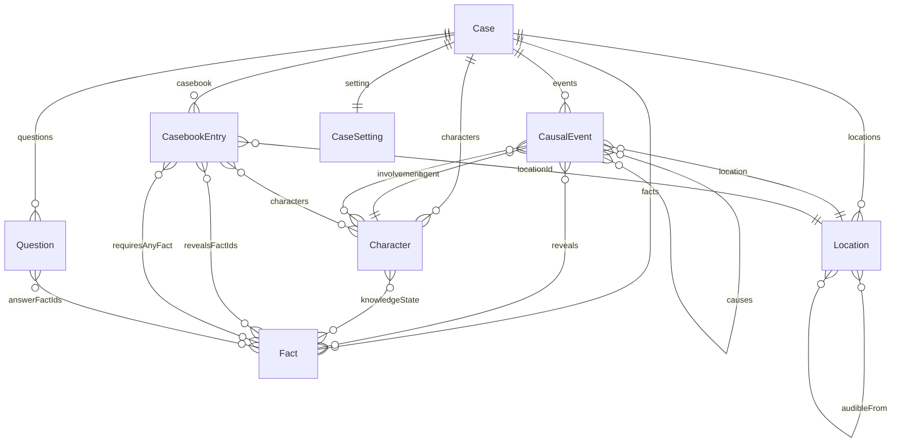
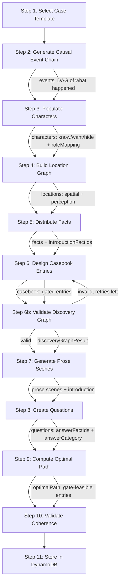

# Consulting Detective -- Data Model Design

## Data Structure Relationships

The Case is the top-level container. Everything else hangs off it.



### Key Relationships

- **Events -> Characters**: Every event has an agent (who did it) and an involvement map tracking how other characters are connected: participant, witness_direct, witness_visual, witness_auditory, informed_after, or discovered_evidence.
- **Events -> Locations**: Every event happened somewhere. Location perception edges (visibleFrom, audibleFrom) and accessibility edges (accessibleFrom) constrain who could have witnessed it.
- **Events -> Facts**: Events reveal facts to witnesses. This is the bridge between "what happened" and "what's discoverable."
- **Characters -> Facts**: The knowledge state tracks what each character knows or suspects about each fact. This shapes what they'll say in their casebook scene.
- **CasebookEntries -> Locations + Characters + Facts**: Entries are the player-facing game mechanic. Each entry takes place at a location, involves certain characters, and reveals specific facts. All entries are gated behind fact discovery (OR-logic via `requiresAnyFact`).
- **Questions -> Facts**: Each question's `answerFactIds` lists the facts that are acceptable correct answers. The player selects from their discovered facts filtered by `answerCategory`. This is what makes the game work: the player must visit enough entries to discover the answer facts.
- **Case.optimalPath -> CasebookEntries**: The minimum ordered set of entries that covers all answer facts for all questions. This is the optimal solution path.

### What the Player Sees vs. What the Generator Builds

The player only interacts with:
- The **introduction** (read once)
- The **casebook** (pick entries to visit, read scenes)
- The **questions** (answer at the end)

Everything else (events, locations, character knowledge states) is generation scaffolding that ensures the case is internally consistent. The player never sees the causal chain or the location graph directly -- they experience them through the prose scenes.

---

## Generation Pipeline



### Pipeline Steps

1. **Select Case Template**: Choose a parameterized crime type (theft-for-debt, jealousy murder, accidental death covered up, etc.) with required event slots and character roles. Cases can be set in any era and setting (Victorian London, 1920s New York, a future orbital station, etc.).

2. **Generate Causal Event Chain**: Fill the template's event DAG with specific details. Each event gets an agent, location, timestamp, and necessity. Required events form the spine; other events add texture. The DAG's `causes` edges define what-leads-to-what. Events describe things that *happened* in the world — never investigation steps.

3. **Populate Characters**: Assign characters to event agent slots. For each character, determine: what they know (knowledgeState: `knows` or `suspects`), what they want, what they hide, and how they speak (tone). Also produces a `roleMapping` (roleId -> characterId) used to replace role placeholders in the event chain with real character IDs. Characters not directly involved in events can serve as witnesses, red herrings, or color. `currentStatus` (e.g. "deceased", "missing") guides who can be met during investigation.

4. **Build Location Graph**: Create the spatial world. Assign events to locations. Define accessibility (accessibleFrom) and perception edges (visibleFrom, audibleFrom). Location types are freeform strings (e.g. "building", "room", "campsite", "street"). Locations include where characters can be found during the investigation, and where witnesses were positioned when they observed events.

5. **Distribute Facts**: Extract facts from events and character states. Tag each fact with a category (motive, means, opportunity, alibi, relationship, timeline, physical_evidence, background, person, place). Person and place facts are identity atoms that serve as gate keys for casebook entries. Select 2-4 introduction facts that seed the investigation.

6. **Design Casebook Entries**: Create the player-facing address book. Every entry is gated — hidden until the player discovers any one of its `requiresAnyFact` facts (OR-logic). Person/place identity facts serve as gate keys. The co-discovery rule ensures that if an entry reveals a fact mentioning a person/place, it also reveals that entity's identity fact. Important facts should be available at multiple entries for different solving paths.

    6b. **Validate Discovery Graph**: Pure computation (no LLM). BFS over the bipartite facts ↔ entries graph starting from introduction facts, verifying all facts and entries are reachable. If validation fails, DesignCasebook is retried with error context (up to 2 retries).

7. **Generate Prose Scenes**: Generated in two LLM calls: one for the introduction and title, one for all casebook scenes (ensures cross-scene coherence). Scenes are filtered through present characters' knowledge states and tone profiles. Characters reveal facts they `know` about, hint at facts they `suspect`, and conceal or misdirect about facts they `hide`. Location perception edges inform scene descriptions.

8. **Create Questions**: Design 4-8 end-of-case quiz questions. The player answers by selecting a fact from their discovered facts, filtered by the question's `answerCategory`. Each question's `answerFactIds` lists acceptable correct answers (all must share the same fact category). Questions are vague and non-spoiling — they don't name specific characters or locations.

9. **Compute Optimal Path**: Solve the set-cover problem: find the minimum ordered set of casebook entries that reveals all answer facts for all questions, respecting gate constraints (each entry's gate facts must be discoverable before visiting it). This becomes the optimal solution path and the scoring baseline.

10. **Validate Coherence**: Check that:
    - Every event has a valid agent and location
    - Every casebook entry references valid locations, characters, and facts
    - `introductionFactIds` and `requiresAnyFact` reference valid factIds
    - Every question's `answerFactIds` are in the discovery-graph reachable set and their categories match `answerCategory`
    - The optimal path is gate-feasible and covers all answer facts
    - Character knowledge states are consistent with events
    - Location graph integrity (valid references in accessibleFrom)

---

## Scoring

After the player submits answers:

```
questionsScore = sum of points for correct answers
visitPenalty = max(0, entriesVisited - optimalEntries) * penaltyPerExtraVisit
finalScore = questionsScore - visitPenalty
```

The fewer entries the player visits while still answering correctly, the higher their score. Visiting every entry guarantees access to all facts but incurs a heavy penalty. The optimal path is the target: answer everything correctly in the minimum number of visits.
