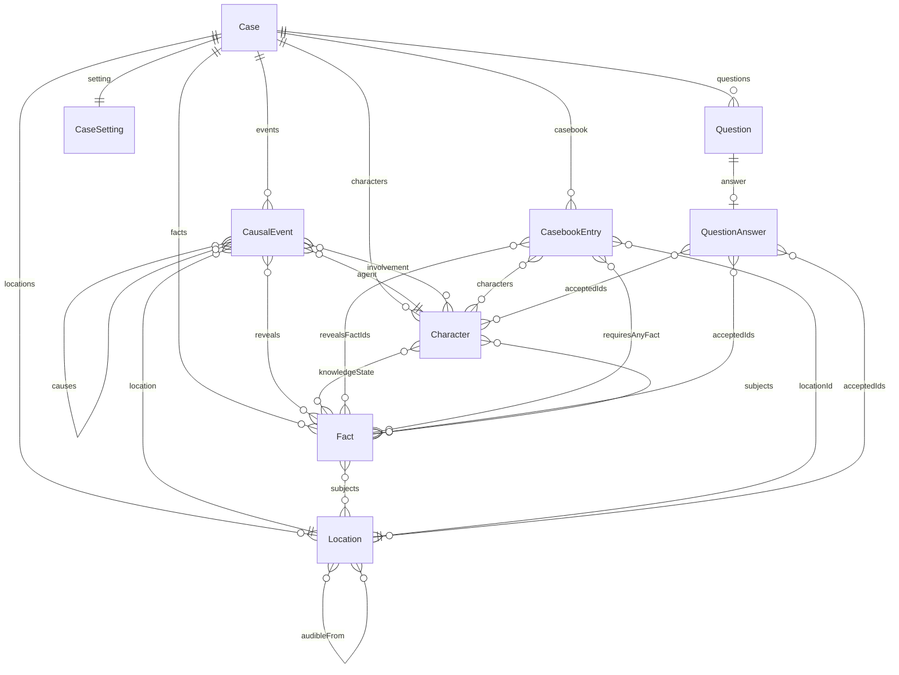
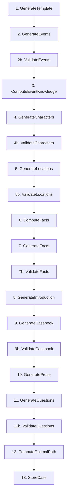

# Consulting Detective -- Data Model Design

## Data Structure Relationships

The Case is the top-level container. Everything else hangs off it.



Note: `CausalEvent.reveals` is `EventReveal[]` (each with id, audible, visible, physical, subjects). `Fact` has `subjects: string[]` and `veracity`. `Question.answer` is `QuestionAnswer`: `type: 'person'|'location'|'fact'`, optional `factCategory`, and `acceptedIds` (characterIds, locationIds, or factIds).

### Key Relationships

- **Events -> Characters**: Every event has an agent (who did it) and an involvement map: `agent`, `present`, `witness_visual`, `witness_auditory`, or `discovered_evidence`. (Secondhand knowledge is modeled as separate events, not `informed_after`.)
- **Events -> Locations**: Every event happened somewhere. Location perception edges (visibleFrom, audibleFrom) and accessibility edges (accessibleFrom) constrain who could have witnessed it.
- **Events -> Facts**: Each event has `reveals: EventReveal[]`. Each reveal has an `id` (factId), perception flags (`audible`, `visible`, `physical`), and `subjects` (character/location IDs the fact is about). This determines how different involvement types learn the fact.
- **Facts**: Each fact has `subjects: string[]` (characterIds and locationIds it is about) and `veracity: 'true' | 'false'`. False facts are discoverable but never correct answers; they model misinformation from characters who deny or believe falsehoods.
- **Characters -> Facts**: `knowledgeState` maps factId to `KnowledgeStatus`: `knows`, `suspects`, `hides`, `denies`, or `believes`. This shapes what they say in their casebook scene.
- **CasebookEntries -> Locations + Characters + Facts**: Entries are the player-facing game mechanic. Each entry is gated on discovering any fact that has that entry's subject in its `subjects` (subject-based gating). Entries reveal facts per character knowledge and location physical evidence.
- **Questions -> Answers**: Each question has `answer: QuestionAnswer` with `type: 'person' | 'location' | 'fact'`. For `person`/`location`, the player selects from discovered subjects; for `fact`, from discovered facts filtered by `factCategory`. `acceptedIds` lists acceptable correct IDs (characterIds, locationIds, or factIds).
- **Case.optimalPath -> CasebookEntries**: The minimum ordered set of entries that covers all accepted answers for all questions. This is the optimal solution path.

### Fact–Subject Graph

Facts and subjects (characters and locations) form a **bipartite graph**: fact nodes connect to subject nodes via `fact.subjects`. A subject is "discovered" when the player learns any fact that has that subject; discovering a subject can gate casebook entries (each subject typically has an entry). The graph is built programmatically in ComputeFacts (bridge facts connect disconnected components; red herrings add noise). Reachability from introduction facts ensures the case is solvable.

### What the Player Sees vs. What the Generator Builds

The player only interacts with:
- The **introduction** (read once)
- The **casebook** (pick entries to visit, read scenes)
- The **questions** (answer at the end)

Everything else (events, locations, character knowledge states) is generation scaffolding that ensures the case is internally consistent. The player never sees the causal chain or the location graph directly -- they experience them through the prose scenes.

---

## Generation Pipeline

Step name prefixes: **Generate** — AI (LLM) steps; **Validate** — data-checking (pure logic); **Compute** — algorithmic (pure logic, no LLM); **Store** — persistence.



### Pipeline Steps

1. **GenerateTemplate**: Choose a parameterized crime type and setting. Optionally define mystery style and narrative tone to guide later steps.

2. **GenerateEvents** + **ValidateEvents**: Fill the template's event DAG. Each event has `reveals: EventReveal[]` (id, audible, visible, physical, subjects). Involvement types: `agent`, `present`, `witness_visual`, `witness_auditory`, `discovered_evidence`. Validation checks structure and references; retries on failure.

3. **ComputeEventKnowledge** (programmatic): From events, build role knowledge baselines and location reveals. Agent/present learn all reveals; witness_visual/auditory learn by perception flags; discovered_evidence learns physical reveals. Location reveals account for cleanup (later event at same location can remove physical evidence).

4. **GenerateCharacters** + **ValidateCharacters**: Assign characters to roles. Receives computed role knowledge; AI may change entries to `suspects`, `hides`, `denies`, or add `believes` for false beliefs. Produces roleMapping. Validation checks knowledge state enum and involvement types.

5. **GenerateLocations** + **ValidateLocations**: Build the spatial world (accessibility, perception edges). Receives location reveals from ComputeEventKnowledge. Validation checks references.

6. **ComputeFacts** (programmatic): Build the fact–subject graph. Collect true fact skeletons from event reveals; create false fact skeletons from denials; detect disconnected components and add bridge facts; add red herring skeletons. Outputs fact skeletons (factId, subjects, veracity, source) and the bipartite graph.

7. **GenerateFacts** + **ValidateFacts**: AI expands each placeholder into a full fact (factId, description, category). Subjects and veracity are already set. Validation checks categories and subject referential integrity.

8. **GenerateIntroduction**: AI selects 2–4 introduction fact IDs that form a coherent hook and seed discovery, and writes the introduction prose and title. Introduction is written here; GenerateProse only does casebook scenes.

9. **GenerateCasebook** + **ValidateCasebook**: Programmatic structure: each subject (character or location) becomes an entry; gating is by facts whose subjects include that subject; reveals come from character knowledge and location reveals. AI polishes labels, addresses, who is present. Validation: BFS reachability from introduction facts.

10. **GenerateProse**: Scenes only (introduction already written). One LLM call for all casebook scenes. Context includes knowledge states (knows, suspects, hides, denies, believes) and fact veracity.

11. **GenerateQuestions** + **ValidateQuestions**: Design 4–8 quiz questions. Answer structure: `type: 'person' | 'location' | 'fact'`, optional `factCategory`, `acceptedIds`. False facts are excluded from answer options. Validation checks answer structure and references.

12. **ComputeOptimalPath**: Set-cover: minimum ordered entries that cover all question answers (acceptedIds), respecting gates. Absorbs coherence checks (path exists, gate-feasible, covers answers).

13. **StoreCase**: Assemble and persist the case (events with EventReveal[], facts with subjects/veracity, characters with full KnowledgeStatus, questions with new answer structure).

---

## Scoring

After the player submits answers:

```
questionsScore = sum of points for correct answers
visitPenalty = max(0, entriesVisited - optimalEntries) * penaltyPerExtraVisit
finalScore = questionsScore - visitPenalty
```

The fewer entries the player visits while still answering correctly, the higher their score. Visiting every entry guarantees access to all facts but incurs a heavy penalty. The optimal path is the target: answer everything correctly in the minimum number of visits.
